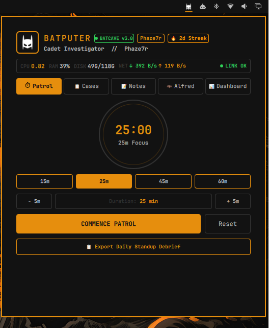
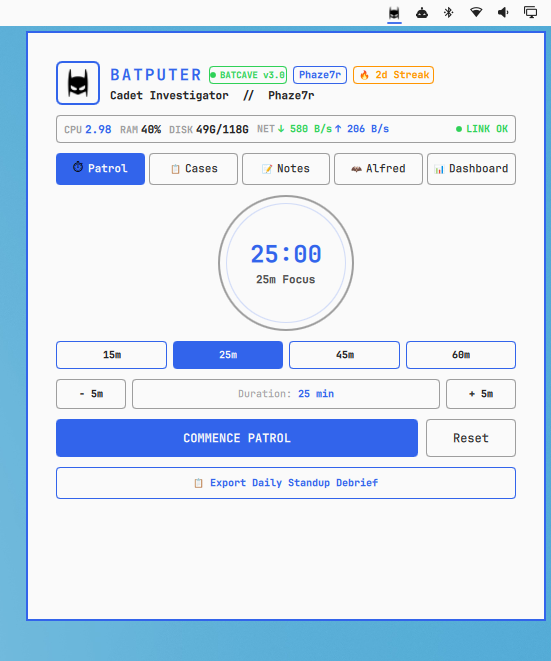
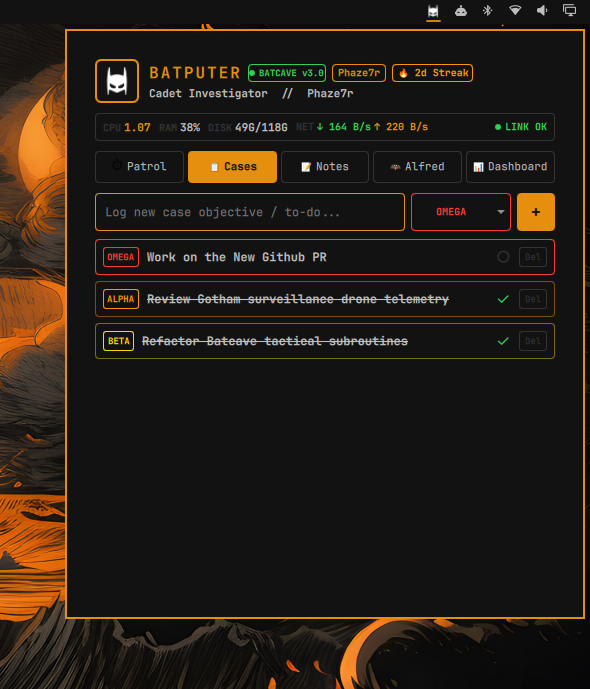
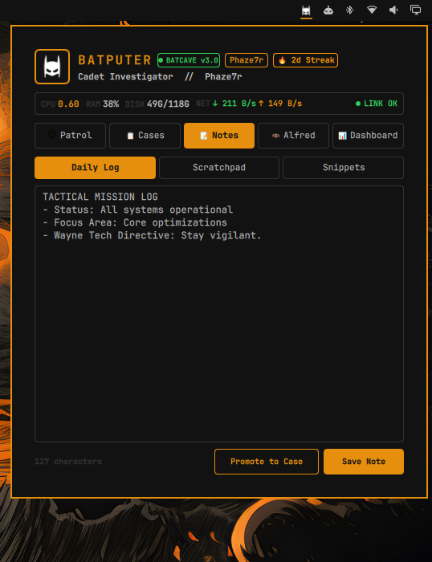
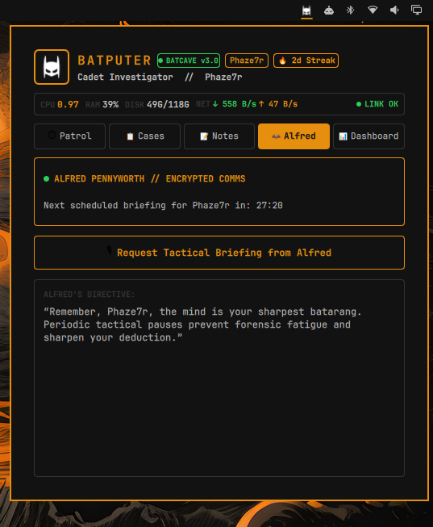
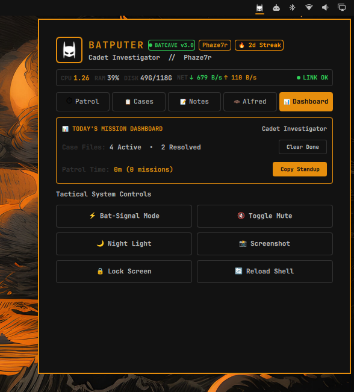

# 🦇 BatPuter v3.0 — Wayne Tech Tactical Productivity HUD

[](https://omarchyplugins.com)
[](https://github.com/phaze7r/batputer/releases)
[](https://omarchy.org)
[](LICENSE)

> *"The Batcomputer is online, Master Wayne."*  
> **BatPuter** is a Gotham-themed tactical daily productivity HUD for the [Omarchy](https://omarchy.org) Linux desktop. Manage your daily agendas, organize tactical to-do lists, log forensic notes, execute customizable patrol sprints, monitor live system telemetry, and export daily standup debriefs — all styled like the World's Greatest Detective's Batcave terminal.

<p align="center">
  
  
</p>

---

## 📑 Table of Contents

- [Interface Gallery](#-interface-gallery)
- [Key Features](#-key-features)
- [Controls & Keybindings](#-controls--keybindings)
- [Installation](#-installation)
- [IPC & Scripting Commands](#-ipc--scripting-commands)
- [Architecture & Files](#-architecture--files)
- [Uninstallation](#-uninstallation)
- [License](#-license)

---

## 📸 Interface Gallery

<p align="center">
  
  
</p>
<p align="center">
  
  
</p>

---

## ⚡ Key Features

### ⏱ Tactical Patrol Focus Engine (Pomodoro)
- **Full Duration Customization**: Choose from quick presets (`15m`, `25m`, `45m`, `60m`) or use inline `[- 5m]` / `[+ 5m]` steppers to set any custom minute duration.
- **Zero-Shift Radial Progress Ring**: Canvas-drawn circular progress arc on the status bar icon that depletes as time elapses without expanding or shifting neighboring bar icons.
- **🔔 Wayne Tech Finish Chime**: Cinematic audio alert (`bat_finish.wav`) plays automatically when a patrol or break session concludes.

### ⚡ Animated Bat-Signal Beacon
- Toggle the Bat-Signal mode from the dashboard to illuminate the status bar icon with an animated golden searchlight aura halo (`#ffd60a`) with rhythmic breathing pulse effects.

### 📊 Daily Mission Dashboard & Quick Controls
- **Live Task Overview**: Real-time counter of Active vs Resolved cases.
- **`Clear Done`**: One-click cleanup to purge all checked-off cases.
- **`Copy Standup`**: Formats today's completed cases, active tasks, patrol focus time, and notes into clean Markdown and copies it straight to your clipboard (`wl-copy`).
- **Tactical System Grid**: One-click controls for Bat-Signal Beacon, Audio Mute, Night Light, Screenshot, Screen Lock, and Shell Reload.

### 🏆 Detective Ranks & Daily Streaks
- **Daily Focus Streaks**: Tracks consecutive daily focus sessions (`🔥 5d Streak`).
- **Detective Progression**: Earn higher detective ranks as you complete missions:
  - 🥋 *Cadet Investigator* (0–2 sessions)
  - 🔍 *Gotham Detective* (3–9 sessions)
  - 🦇 *Caped Crusader* (10–24 sessions)
  - 🌌 *The Dark Knight* (25+ sessions)

### 📈 Live Batcave Telemetry HUD
- High-contrast, prominent real-time monitors built directly into the HUD header:
  - **CPU Load**: Live load average from `/proc/loadavg`.
  - **RAM Usage**: Real-time memory percentage from `/proc/meminfo`.
  - **Disk Space**: Partition utilization from root mount.
  - **Network Speeds**: Live Download (`↓`) and Upload (`↑`) rates from `/proc/net/dev`.
  - **Wayne Secure Link**: Quantum encryption status indicator.

### 📂 Active Case Files & Objective Tracking
- Threat-level priority classifications:
  - 🔴 `OMEGA` (Critical)
  - 🟠 `ALPHA` (High)
  - 🟡 `BETA` (Medium)
  - 🟢 `GAMMA` (Low)
- One-click task resolution with tactical strike-through and minimal `Del` action.

### 📝 Simplified 3-Category Forensic Notes
- Fixed, reliable 3-category scratchpad:
  - `Daily Log`
  - `Scratchpad`
  - `Snippets`
- **`Promote to Case`**: Promotes any note line or thought directly into an active `ALPHA` case file with one click.
- Live character counter and instant autosave.

### 🦇 Theme-Adaptive Cowl Silhouette
- Solid-fill, anti-aliased Dark Knight cowl icon that automatically shifts to crisp white on dark bars and deep black on light bars based on ambient background luminance.

---

## 🎮 Controls & Keybindings

| Action | Shortcut / Control |
| :--- | :--- |
| **Toggle BatPuter HUD** | Left-Click Bar Icon / `SUPER + B` |
| **Start / Pause Patrol Timer** | Right-Click Bar Icon |
| **Reset Patrol Timer** | Middle-Click Bar Icon |
| **Adjust Focus Duration** | Click Presets (`15m`, `25m`, `45m`, `60m`) or `[- 5m]` / `[+ 5m]` |
| **Export Daily Standup** | Click `Export Daily Standup Debrief` in Patrol or Dashboard Tab |
| **Toggle Bat-Signal Aura** | Click `⚡ Bat-Signal Mode` in Dashboard Tab |
| **Edit Detective Callsign** | Click `👤 [Callsign]` badge in HUD Header |

---

## 📦 Installation

Install directly via the Omarchy Plugin Manager:

```bash
omarchy plugin add https://github.com/phaze7r/batputer.git --enable
```

---

## 🤖 IPC & Scripting Commands

BatPuter exposes IPC endpoints for custom Hyprland keybinds and scripts:

```bash
# Toggle HUD open / close
omarchy-shell batputer toggle

# Focus Patrol Timer Controls
omarchy-shell batputer startFocus
omarchy-shell batputer pauseFocus
omarchy-shell batputer resetFocus

# Toggle Bat-Signal Beacon
omarchy-shell batputer toggleSignal

# Request Tactical Briefing from Alfred
omarchy-shell batputer checkIn
```

---

## 📁 Architecture & Files

```
batputer/
├── manifest.json         # Omarchy Quattro Plugin Manifest (v3.0.0)
├── BarWidget.qml         # Bar integration, radial progress ring, IPC handlers
├── Panel.qml             # Tactical Operations HUD, Telemetry, Cases, Notes, Alfred
├── BatmanMaskIcon.qml    # Theme-aware cowl icon with Bat-Signal searchlight halo
├── Storage.js            # Telemetry, speed formatting, rank calculations & debrief exporter
├── LICENSE               # MIT License
├── README.md             # Documentation & showcase
└── assets/
    ├── bat_finish.wav    # Cinematic Wayne Tech chime
    ├── batman_white.png  # Solid white cowl silhouette
    ├── batman_black.png  # Solid black cowl silhouette
    └── *.png             # Interface screenshots & preview assets
```

---

## 🗑 Uninstallation

```bash
omarchy plugin remove batputer
omarchy restart shell
```

---

## 📄 License

Distributed under the [MIT License](LICENSE). Built for the [Omarchy](https://omarchy.org) Linux Desktop ecosystem.
