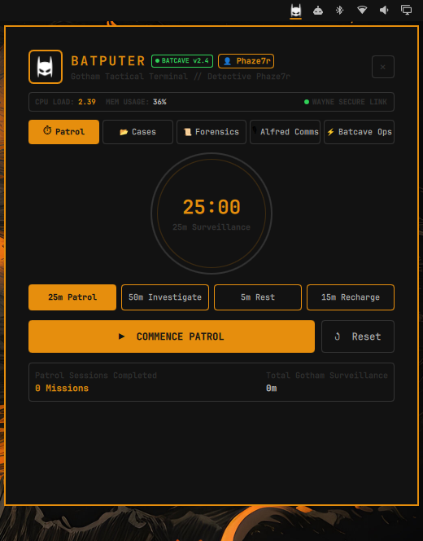
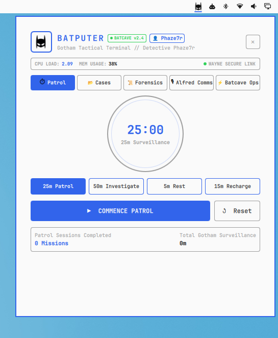

# 🦇 BatPuter — Wayne Tech Tactical Productivity HUD

[](https://omarchyplugins.com)
[](LICENSE)

> *"The Batcomputer is online, Master Wayne."*  
> **BatPuter** is a Gotham-themed tactical daily productivity HUD for the [Omarchy](https://omarchy.org) Linux desktop. Manage your daily agendas, organize tactical to-do lists, log forensic notes, and execute focused patrol sprints — all styled like the World's Greatest Detective's Batcave terminal.

<p align="center">
  
  
</p>

---

## ⚡ Productivity Features (Batcave Style)

- 📂 **Case Files (Daily Agenda & To-Do Lists)**:
  - Track your daily tasks and mission objectives disguised as active Gotham case files.
  - Threat-level priority tags: `OMEGA` (Critical), `ALPHA` (High), `BETA` (Medium), and `GAMMA` (Low).
  - One-click task completion with tactical strike-through and case resolution metrics.

- 📜 **Forensic Dossiers (Multi-Tab Notes & Scratchpad)**:
  - Multi-tab scratchpad system (`Forensic Analysis`, `Case Dossier`, `Wayne Directives`, plus unlimited custom tabs).
  - Store quick thoughts, code snippets, daily logs, and meeting debriefs with live byte counting and instant autosave.

- ⏱ **Tactical Patrol Focus Timer (Pomodoro Engine)**:
  - Stay hyper-focused during work blocks with a radar-sweep circular countdown timer.
  - Preset intervals: `25m Patrol Focus`, `50m Deep Investigation`, `5m Tactical Rest`, and `15m Batcave Recharge`.
  - Live timer badge on the status bar and daily completed mission telemetry.

- 🎙 **Alfred Pennyworth Comms & Check-Ins**:
  - Encrypted check-in channel delivering periodic focus prompts and tactical encouragement to keep you on mission.
  - Customizable Detective Callsign (`Master Wayne`, `The Detective`, `Bruce`, or your own custom name).
  - Manual "Request Briefing" button for instant tactical check-ins.

- 📊 **Real-time Batcave Telemetry**:
  - Real-time CPU load, memory usage, and Wayne Tech quantum encryption link status built directly into the HUD header.

- ⚡ **Batcave Operations (Quick Ops)**:
  - Fast desktop shortcuts: Batcave Lockdown, Gotham Night Light, HUD Recon Screenshot, Comms Silence (Mute), Reboot Batcomputer, and Bat-Signal Beacon mode.

- 🦇 **Adaptive Cowl Icon**:
  - Vectorized Dark Knight cowl silhouette that automatically shifts to crisp solid white on dark bars and deep solid black on light bars.

---

## 📦 Installation

### Method 1: Via Omarchy CLI (Recommended)
```bash
omarchy plugin add https://github.com/phaze7r/batputer.git --enable
```

### Method 2: Manual Clone
```bash
git clone https://github.com/phaze7r/batputer.git ~/.config/omarchy/plugins/batputer
omarchy restart shell
```

---

## 🎮 Controls & Keybindings

| Action | Control |
| :--- | :--- |
| **Toggle BatPuter HUD** | Left-Click Bar Icon / `SUPER + B` |
| **Start / Pause Patrol Timer** | Right-Click Bar Icon |
| **Reset Patrol Timer** | Middle-Click Bar Icon |
| **Edit Detective Callsign** | Click `👤 [Callsign]` badge in HUD Header |

---

## 🗑 Uninstallation

```bash
omarchy plugin remove batputer
omarchy restart shell
```

---

## 📄 License

This project is licensed under the [MIT License](LICENSE).
